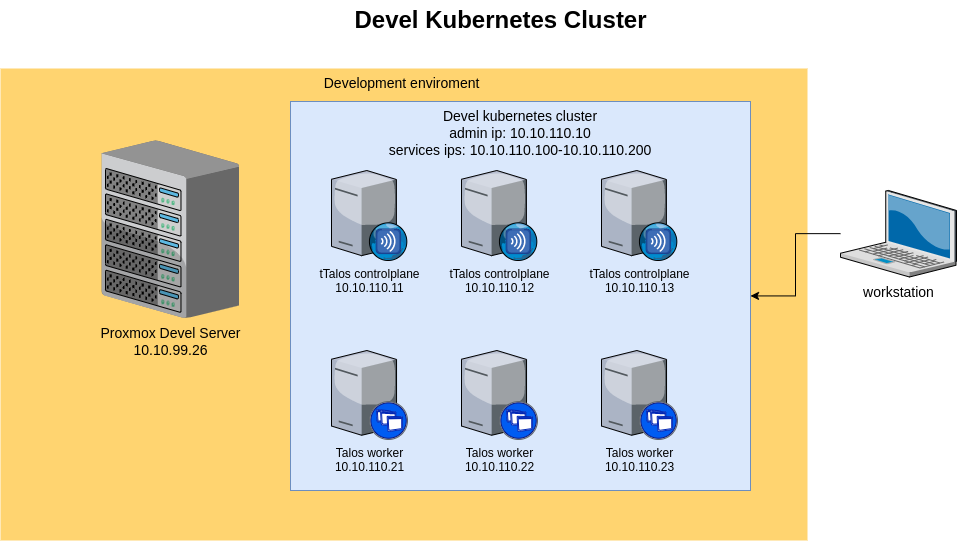

# kubernetes-talos-HA-cluster

A repository to keep resources and configuration files used with my Kubernetes talos high ability cluster

# Queick Links

1. [Content of the Repository](#content-of-the-repository)
2. [Cluster Diagrams](#Cluster-diagrams)
3. [Network Configuration](#network-configuration)
4. [Cluster Infrastructure](#homelab-infrastructure)
    * [Hardware](#hardware)
    * [Homelab Root CA](#homelab-root-ca)
5. [Deployment](#deployment)

# Content of the Repository
* [`docs`](./docs/) - images and documentation files.

# Homelab Network Diagram

# Network Configuration

* devel cloud IP range: 10.10.110.0/24
* basic cloud IP range: 10.10.210.0/24
* gateway/DNS/DHCP/NTP/SMTP server: `X.X.X.1`
* admin: X.X.X.2

Hostnames and their IP addresses in devel:
| Hostname          | IP Address   | Information                                            | OS |
|:------------------|:-------------|:-------------------------------------------------------|:---|
| mikrotik.local    | 10.10.110.1  | Mikrotik router                                        | RouterOS |
| admin.local       | 10.10.110.2  | DNS/DHCP master, NTP, SMTP, HAProxy master, Keepalived | debian 11 |
| proxmox06.local   | 10.10.99.26  | KVM hypervisor                                         | proxmox 7.1 |
| kubelb.local      | 10.10.110.10 | Virtual IP address for HAProxy/keepalived              | N/A |
| dtalos11.local    | 10.10.110.11 | Kubernetes control plane                               | Talos 1.0 |
| dtalos12.local    | 10.10.110.12 | Kubernetes control plane                               | Talos 1.0 |
| dtalos13.local    | 10.10.110.13 | Kubernetes control plane                               | Talos 1.0 |
| dtalos21.local    | 10.10.110.21 | Kubernetes worker node                                 | Talos 1.0 |
| dtalos22.local    | 10.10.110.22 | Kubernetes worker node                                 | Talos 1.0 |
| dtalos23.local    | 10.10.110.23 | Kubernetes worker node                                 | Talos 1.0 |

Hostnames and their IP addresses in base:
| Hostname          | IP Address   | Information                                            | OS |
|:------------------|:-------------|:-------------------------------------------------------|:---|
| mikrotik.local    | 10.10.210.1  | Mikrotik router                                        | RouterOS |
| admin.local       | 10.10.210.2  | DNS/DHCP master, NTP, SMTP, HAProxy master, Keepalived | debian 11 |
| proxmox01.local   | 10.10.99.21  | KVM hypervisor                                         | proxmox 7.1 |
| proxmox02.local   | 10.10.99.22  | KVM hypervisor                                         | proxmox 7.1 |
| proxmox03.local   | 10.10.99.23  | KVM hypervisor                                         | proxmox 7.1 |
| kubelb.local      | 10.10.210.10 | Virtual IP address for HAProxy/keepalived              | N/A |
| talos11.local     | 10.10.210.11 | Kubernetes control plane                               | Talos 1.0 |
| talos12.local     | 10.10.210.12 | Kubernetes control plane                               | Talos 1.0 |
| talos13.local     | 10.10.210.13 | Kubernetes control plane                               | Talos 1.0 |
| talos21.local     | 10.10.210.21 | Kubernetes worker node                                 | Talos 1.0 |
| talos22.local     | 10.10.210.22 | Kubernetes worker node                                 | Talos 1.0 |
| talos23.local     | 10.10.210.23 | Kubernetes worker node                                 | Talos 1.0 |

# Cluster Infrastructure

My goal is to build a reproducible governorate cluster with devops in mind

## Hardware

| Hostname | CPU Cores | RAM (MB) | Storage | OS |
| --- | --- | --- | --- | --- |
| mikrotik.local  |  4 |  4Gb | 128 MB | routeros |
| proxmox01.local | 32 | 64Gb | HDD+SSD | proxmox 7.1 |
| proxmox02.local | 32 | 64Gb | HDD+SSD | proxmox 7.1 |
| proxmox03.local | 32 | 64Gb | HDD+SSD | proxmox 7.1 |
| proxmox06.local | 32 | 64Gb | HDD+SSD | proxmox 7.1 |
| dtalos1x.local  |  4 |  4Gb | SSD | proxmox 7.1 |
| dtalos2x.local  |  4 |  8Gb | HDD+SSD | proxmox 7.1 |
| talos1x.local   |  4 |  4Gb | SSD | proxmox 7.1 |
| talos2x.local   |  4 |  8Gb | HDD+SSD | proxmox 7.1 |

# Deployment

The commissioning phase assumes that the environment is built.
